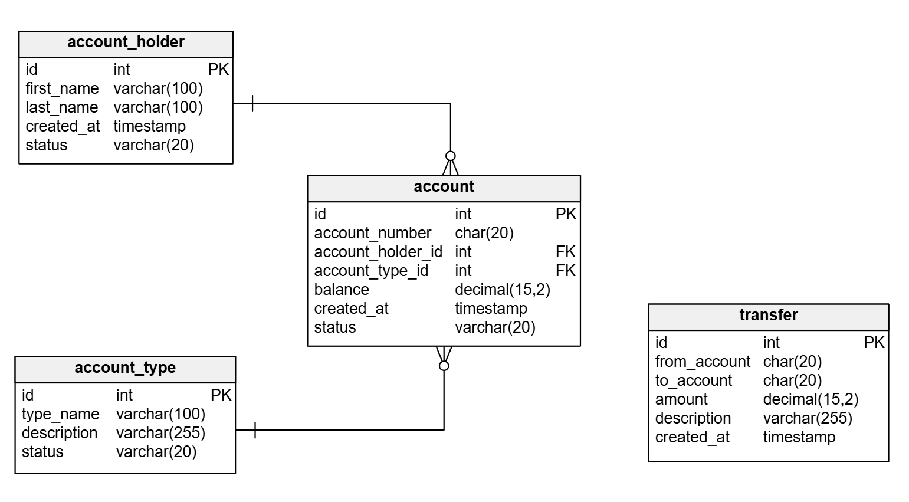

# Bank Account Manager

A simple Spring Boot application (Java 21) that simulates a small bank account management system using an in-memory HyperSQL (HSQLDB) database.

It includes CRUD operations for account holders, account types and accounts, plus money transfers between accounts with basic validations.

### Author
Ragnis Pärnmets

---

## Table of Contents
1. [Description](#description)
2. [Prerequisites](#prerequisites)
3. [Database Structure](#database-structure)
4. [Getting Started](#getting-started)
   - [Clone the repository](#clone-the-repository)
   - [Build & Run (IntelliJ IDEA)](#build--run-intellij-idea)
5. [Swagger UI](#swagger-ui)
6. [Configuration](#configuration)
7. [Database Initialization](#database-initialization)

---

## Description
This project provides a minimal banking domain to demonstrate a RESTful service with persistence and initialization via SQL scripts.

At startup, the schema and seed data are loaded into an in-memory HSQLDB, so you can immediately try the API and explore the data. The app also exposes OpenAPI/Swagger UI for quick testing.

Key capabilities:
- Manage account holders, account types, and accounts (create, read, update, delete).
- Perform transfers between accounts with validations (e.g., sufficient funds, positive amounts, no self-transfers).
- View and try the endpoints using the built-in Swagger UI.

---

## Prerequisites
- Java 21 (JDK)
- IntelliJ IDEA (recommended)
- Internet access to download Gradle dependencies

No external database is required: HSQLDB runs in-memory and is started automatically by the application.

---

## Database Structure


The schema contains four core tables:
- account_holder
- account_type
- account (with unique account_number and foreign keys to holder and type)
- transfer

---

## Getting Started

### Clone the repository
```
git clone https://github.com/Ragnis-Parnmets/bank-account-manager.git
cd bank-account-manager
```

### Build & Run (IntelliJ IDEA)
- Open the project in IntelliJ IDEA as a Gradle project.
- Ensure JDK 21 is selected (Project Structure → SDKs and Project SDK).
- Run the application class: com.example.bank_account_manager.BankAccountManagerApplication.
- The app starts on port 8080 by default.

---

## Swagger UI
Once the application is running, open the Swagger UI in your browser:
- http://localhost:8080/swagger-ui

This UI lets you inspect the API and execute requests directly from the browser.

---

## Configuration
Basic settings are in src/main/resources/application.properties. Important ones:
- spring.datasource.url=jdbc:hsqldb:mem:mydb (in-memory DB)
- spring.jpa.hibernate.ddl-auto=none (schema managed by SQL scripts)
- spring.sql.init.mode=always (always run schema.sql and data.sql at startup)

For convenience, an HSQL server is also started on port 9001, pointing at the same in-memory DB. You can connect from IntelliJ’s Database tool using:
- User: sa
- URL: jdbc:hsqldb:hsql://localhost:9001/mydb

---

## Database Initialization
On startup, Spring runs the SQL initialization scripts located in src/main/resources:
- schema.sql creates the tables and constraints.
- data.sql seeds example account holders, account types, accounts, and transfers.

Because the database is in-memory, data resets on each restart. This ensures a clean, repeatable demo environment.